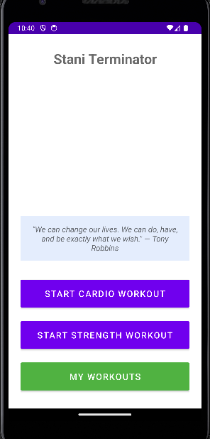
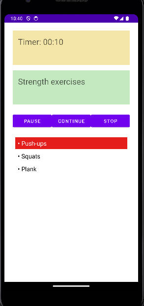
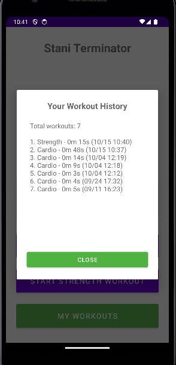

# Stani Terminator

## Screenshots

  
  
  

This is a simple Android fitness app made with **Kotlin** for my university project.  
The goal was to show the main Android concepts in one application.

## Features
- **Two Activities**
    - Main screen (choose workout, see a quote, view history)
    - Workout screen (timer + exercises)

- **Fragments**
    - TimerFragment → shows a running timer
    - ExerciseFragment → shows exercises and highlights them every 20 seconds

- **Service**
    - WorkoutTimerService → runs in background and updates the timer every second

- **API call**
    - Gets motivational quotes from [ZenQuotes API](https://zenquotes.io/api/random)

- **SQLite Database**
    - Saves finished workouts (type, duration, date)
    - Shows workout history in a dialog

## How to run
1. Open the project in **Android Studio**
2. Connect a device or emulator
3. Run the app
4. The app needs internet for the quotes